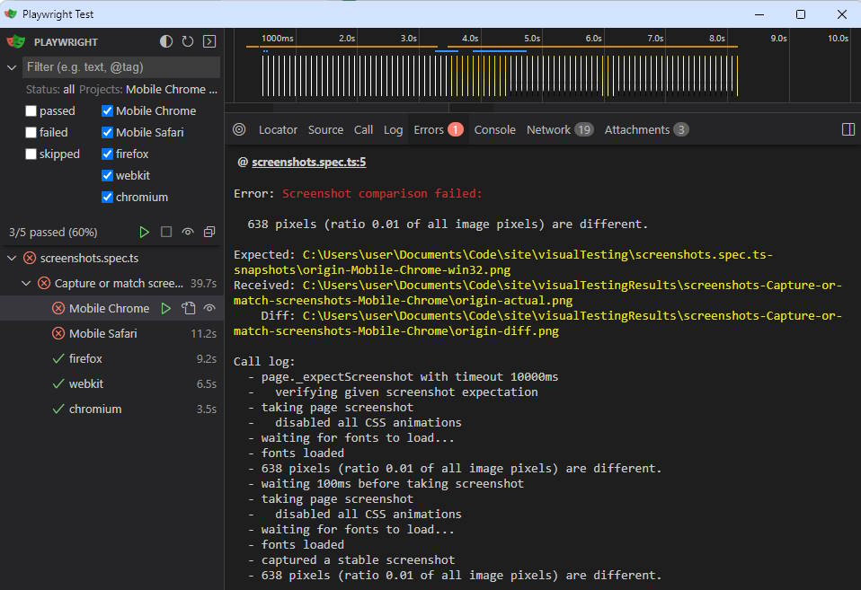

# End-to-End Testing with Playwright

## 🚨Reasons for Implementation

The project ensures that each new feature, once approved, is merged into the main branch and deployed to production. However, visual bugs (missing elements, shifted images) couldn't always be quickly detected manually. To address this, end-to-end testing with Playwright was implemented.

## 🔬How It Works (Briefly)

Before pushing changes to GitHub, developers can run end-to-end tests with

```
npx playwright test
```

Playwright starts a server with the modified code, takes full-page screenshots, and compares them with reference images. Discrepancies result in test failures, with comparison results saved in the `src/__tests__/visualTesting/results` folder, helping identify and fix issues.

## ⚙️Installation, Configuring and Preparing

- make sure that all dependencies are installed:

```
npm install
```

- ⚠️ if you use Playwright for the first time, installing browser's engines is required:

```
npx playwright install
```

- ⚠️ make sure Vite develop server is able to use `localhost:5173` port. On start Playwright runs dev server automatically and then goes to the hardcoded http://localhost:5173 page.

There are no any other configurations and preparations for testing.

## 📝Typical Use Cases for Beginners

### 🕵Detecting Visual Bugs Using User Interface

- run

```
npx playwright test --ui
```

- choose browsers for testing and run any test you need separately or all the tests at once



- if there are any problems whith screenshots comparison, go to `src/shared/__tests__/visualTesting/results` and watch the results like this:


### 🕵Detecting Visual Bugs Using Terminal

- run command and wait for the results;

```
npx playwright test
```

- if there are any problems whith screenshots comparison, go to `src/shared/__tests__/visualTesting/results` and watch the results.

### 🔁Update Screenshots

When intentional design changes cause test failures, to create new references use one of the following ways:

- update all the screenshots across the project using

```
npx playwright test --update-snapshots
```

- to update one or several screenshots only, please delete outdated reference images from the according folder (`src/shared/__tests__/visualTesting/[NAME_OF_THE_TEST].spec.ts-snapshots`) and rerun tests again. On testing without samples, Playwright firstly will create them from your code.

### 👀 Real-time Browsing via Specified Engine

You can browse websites using a specific rendering engine. To do that, please use command:

```
npx playwright open -b webkit rs.school
```

```
npx playwright open -b chromium rs.school
```

```
npx playwright open -b firefox rs.school
```

## 🆕Handling Intentional Changes

If intentional changes affect the site's appearance, update the reference images by deleting the old ones and rerunning the tests. The library will create new reference samples.

## 🆘Troubleshooting and Errors

### 🗐 Screenshot Comparison Failed

When tests fail, review the error messages and comparison images in the `src/shared/__tests__/visualTesting/results` folder to understand what went wrong. Common issues include layout shifts, missing elements, or unintended changes in styling.

### ⏳Timeout Error

When you get `Timeout [number]ms exceeded` error, it makes sence to rerun tests again or run falling test separately using UI. In most cases running the only test prevents appearing such an error.
