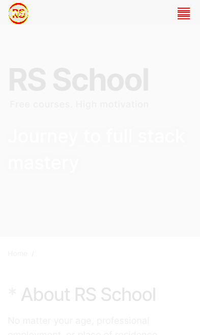
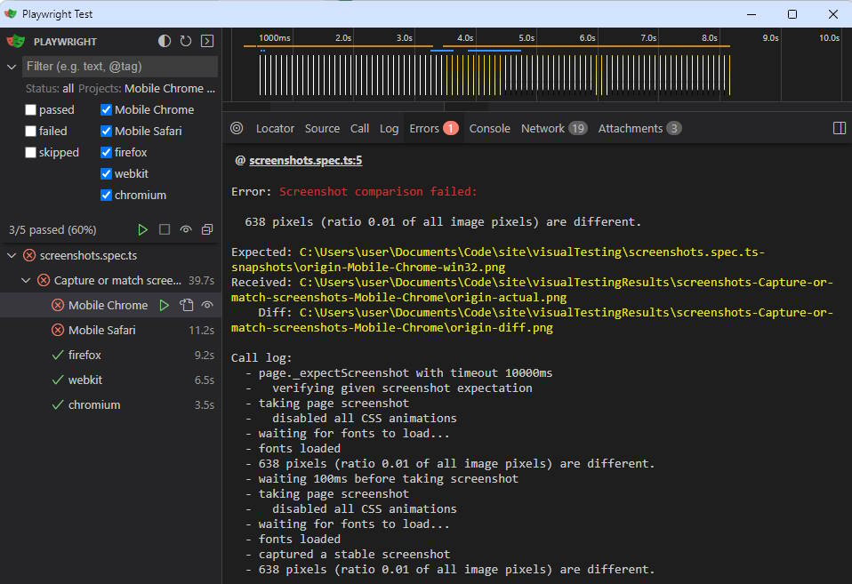

**Reasons for Implementation**

The project is developed in such a way that each new feature, after being approved by colleagues, is directly merged into the main branch and immediately goes into production. However, the developers faced a problem: not all bugs in the appearance of the application (missing elements, shifted images) could be quickly detected manually.

To solve this problem, end-to-end testing was implemented using Playwright.

**How it works**

At this stage, testing works as follows: before sending changes to GitHub, Husky runs all unit tests, as well as end-to-end testing.

During end-to-end testing, Playwright starts the server, using the modified developer's code, takes screenshots of the full pages of the application, and compares them with reference samples, which are already stored in the repository. If discrepancies are found, the test exits with an error and the results of comparing the old and new appearance of the site is saved in `visualTestingResults` folder in the root of the repository. This allows determining exactly where the problem arose, and eliminate it.

**In case the site has undergone intentional changes**

If the site has undergone intentional changes in appearance, and the developer getting an error realizes that the changes in the design are not a bug, it is enough for the developer to delete the `visualTesting/screenshots.spec.ts-snapshots` folder with reference samples, and run end-to-end testing using the command `npx playwright test`.

When you first start testing without samples, the library will create them independently.

**For ease of testing**

For ease of testing and checking its results, the library has a user interface, which can be launched with the command `npx playwright test --ui`.

