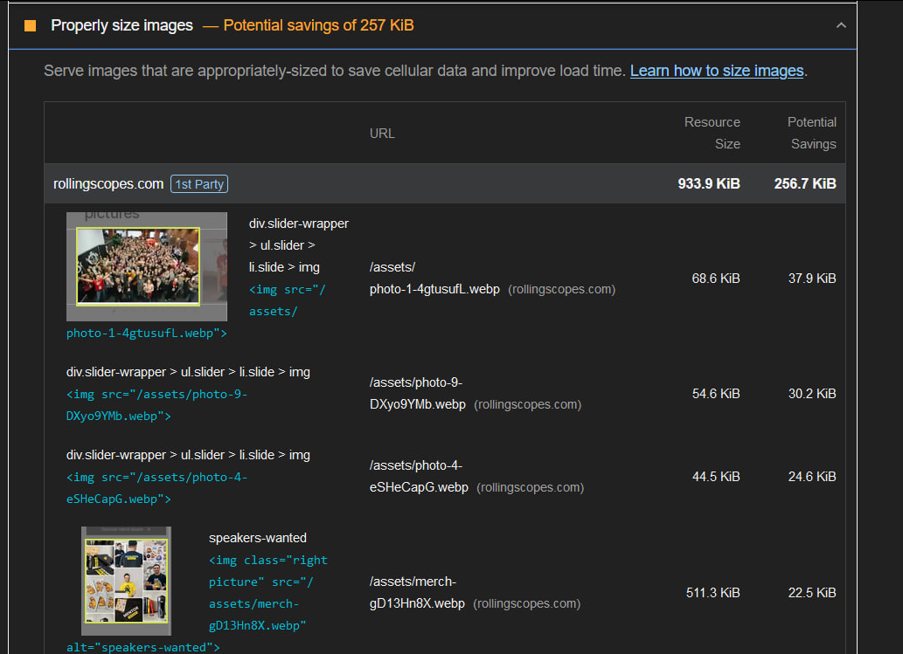

# 🎴 Automated assets optimization

## 💫 Introduction

The problem that we faced is that we experience troubles with initial page loading, because of too many images are trying to load all at once, even if this images are not yet visible on the page (especially noticeable on devices, with slow internet connection)

🫢 Therefore we are facing a significant performance drop on initial page load, which is unacceptable in modern web:



For faster loading, developers use modern `WebP` images and `lazy loading`. This means images only download when they appear on screen.

Our motivation is that developers shouldn't think about any trivial performance optimization and focus on his more important job.

Therefore we introduced an automated image optimization technique that will produce all the necessary work by himself. The optimizations are performed in a super simple way:

🎉 Developers are using our brand new component API `<Image />`. That will perform all the necessary optimizations automatically.

### ⚠️ The only thing that developer must to watch closely
Is that the images that will be loaded on the start screen - must be loaded with `high priority`, that means that for such images **we need to disable lazy loading**, because it makes no sense to load them lazily 🤷‍♂️, and will produce performance drop.


## 🚀 Public API

Familiar API - you can use the component just like basic `img` element, all optimizations are handled behind the scenes for you.
```tsx
// The old way

```
```tsx
// The new way (lazy loading is turned on implicitly)
<Image src={photo} alt="Person's photo" />
```

```tsx
// Explicitely disabled lazy loading 
// should be used if an image is on the start screen
<Image src={photo} alt="Person's photo" lazy="false" />
```

The src prop can accept image of any format - `.jpg`, `.jpeg`, `.png`... Everything will be converted to `WebP` behind the scenes.

🔮 In the very end this will produce such result: 

```html

```

## 🤔 How is it working behind the scenes?
1. Any image of any format will be converted to `WebP` and compressed
2. If an image is already in `WebP` format it'll be only compressed
3. `SVG` are compressed as well, using [SVGO](https://github.com/svg/svgo)
4. At the build step the 2 more variants of the image will be generated based on `env` variables breakpoints. By default it's `768px` image for `tablets` and `425px` for `mobile`.

You can also correct the compression value from `1 to 100` - where `1` is the most compressed image and `100` is the most quality respectful.

⚠️ Unfortinally, we need to duplicate the `env` variables in the `build` script and in the `optimizeImages` script. Because the `env` variables are defined for the each script's runtime separatelly.

```JSON
{
  "build": "tsc && npx cross-env VITE_TABLET=768 VITE_MOBILE=425 vite build && npm run optimizeImages",
  "optimizeImages": "npx cross-env VITE_TABLET=768 VITE_MOBILE=425 VITE_COMPRESS_QUALITY=80 node optimizeImages/optimizeImages.js"
}
```

Also should be mentioned that if an image is very small e.g `90px:90px` and the `env` variables are greater that this image size, no optimization will be performed for such image - therefore will not be created 2 different smaller sizes.

The `<Image />` component also know how to deal in such situation, and if there are no responsive image variants for `tablet` and `mobile` - it will fallback to basic `src` image (in our case image of `90px:90px`)

### ⚠️ To check if responsive images are generated - first build the project and then run ```npm run preview```.

### ⛔ **No optimizations are performed for development mode**

## 🧠 Source
You can check out the links with a deep dive into the image optimization in the modern web, that are been used for our topic:

* [Browser-level image lazy loading for the web](https://web.dev/articles/browser-level-image-lazy-loading)
* [Optimize Largest Contentful Paint](https://web.dev/articles/optimize-lcp)
* [Lazy loading images](https://web.dev/articles/lazy-loading-images)
* [Preload responsive images](https://web.dev/articles/preload-responsive-images)
* [Lazy loading images in 2024](https://medium.com/@iliketoplay/lazy-loading-images-in-2024-9b579e885e07)

## 📚 Libraries that have been used

* [Sharp](https://sharp.pixelplumbing.com/api-resize#resize)
* [SVGO](https://github.com/svg/svgo)
