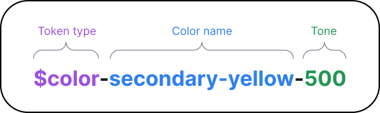
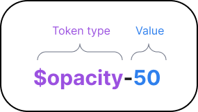

# Style Guide
The Style Guide defines visual design standards, typography, color palette, dimensions, shape and other aspects, ensuring uniformity and simplifying the development process.

Please follow the rules and tokens provided in the guide.

#### General rules
1. Use kebab case notation for tokens naming.

## 🎨 Colors
### Usage
```scss
{
  background-color: rgba($color-secondary-yellow, $opacity-8);
  color: $color-primary-black;
}
```

### Token Name



1. Token type: `$color`
2. The name of the color.
3. Tone (optional).

### List of Tokens Used
|   | Token | HSL | HEX |
| ----------- | ----------- | ----------- | ----------- |
|  | $$Primary$$ |  |  |  |
|     |   `$color-primary-black`        | hsla(0, 0%, 0%) |   #000   |
|      |   `$color-primary-white`        | hsla(0, 0%, 100%) |   #fff   |
|  | $$Yellow$$  |  |  |  |
|   |   `$color-secondary-yellow`     | hsla(50, 100%, 56%) |   #ffdb20   |
|   |   `$color-secondary-yellow-700` | hsla(40, 58%, 25%) |   #664d1b   |
|   |   `$color-secondary-yellow-500` | hsla(49, 87%, 53%) |   #efc91f   |
|   |   `$color-secondary-yellow-50`  | hsla(40, 100%, 97%) |   #fffaf0   |
|  | $$Red$$ |  |  |  |
|   |   `$color-secondary-red`        | hsla(6, 65%, 52%) |   #d44333   |
|  | $$Gray$$ |  |  |  |
|   |   `$color-secondary-gray-600`    | hsla(0, 0%, 33%) |   #545454   |
|   |   `$color-secondary-gray-500`    | hsla(0, 0%, 46%) |   #757575   |
|   |   `$color-secondary-gray-400`    | hsla(0, 0%, 69%) |   #afafaf   |
|   |   `$color-secondary-gray-200`    | hsla(0, 0%, 90%) |   #e6e6e6   |
|   |   `$color-secondary-gray-100`    | hsla(0, 0%, 95%) |   #f2f2f2   |

## 🫧 Opacity
### Usage
```scss
{
  background-color: rgba($color-secondary-yellow, $opacity-8);
  color: rgba($color-primary-black, $opacity-80);
  opacity: $opacity-100;
}
```

### Token Name



1. Token type: `$opacity`
2. The opacity value (as a percentage).

### List of Tokens Used
| Token | Value |
| ----------- | ----------- |
| `$opacity-100` | 1 |
| `$opacity-80` | 0.8 |
| `$opacity-50` | 0.5 |
| `$opacity-20` | 0.2 |
| `$opacity-8` | 0.08 |
| `$opacity-0` | 0 |

## 🇦 Fonts
🚧 The section is in development 🚧

## ⬆️ Size
🚧 The section is in development 🚧

## ✨ Effect
🚧 The section is in development 🚧