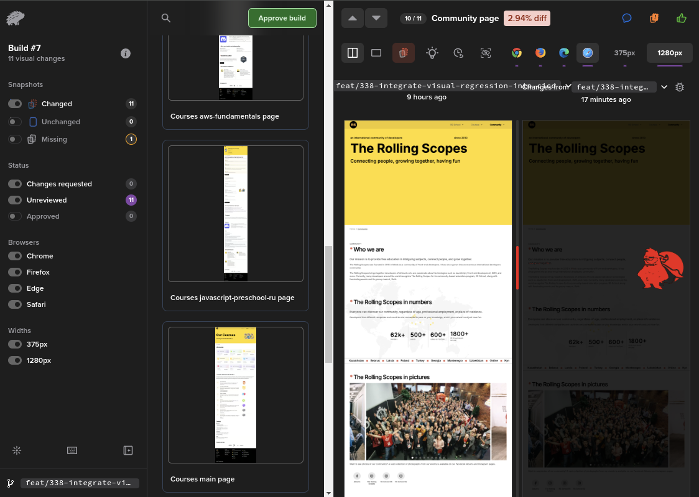

# Visual Testing with Percy and Playwright

## 🚨Reasons for Implementation

In our project, new features are merged into the main branch and deployed to production once approved. However, visual bugs—like missing elements or misaligned images—are not always easy to spot manually. To catch these issues early, we implemented automated visual testing using Percy and Playwright.

## 🔬 How It Works

Percy and Playwright help automate the detection of visual differences in the application by comparing screenshots against established baselines. Here’s a closer look at the process:

- **Baseline Screenshots:** Percy maintains a set of baseline images that represent the expected appearance of the application. These baselines are used as the standard for comparison in visual tests.
- **Visual Comparison:** When a developer triggers a visual test, Percy takes new screenshots of the modified application and compares them to the existing baseline images. Percy’s advanced algorithms detect even the smallest visual differences, such as pixel shifts, missing elements, or color changes.
- **Handling Discrepancies:** If differences are found, they are highlighted in Percy’s dashboard, where developers can review and approve changes. Discrepancies must be either fixed or approved; if the changes are intentional and correct, the new screenshots can be set as the updated baselines.
- **Updating Baselines:** Once the visual changes are approved, the new screenshots replace the old baselines. This ensures that future comparisons are always against the latest approved version of the application.

## Workflow

1. **Create a PR:** A developer submits a PR with code changes.
2. **Trigger Visual Tests:** The developer comments `run visual now` on the PR.
3. **Run Tests:** The CI/CD pipeline triggers Percy to capture screenshots of the updated application.
4. **Compare Screenshots:** Percy compares the new screenshots with the reference images.
5. **Review Results:** If differences are detected, the test fails, and the results are displayed on the Percy dashboard.  
   
6. **Fix Issues and Re-run:** The developer addresses the identified visual issues and re-runs the visual tests.
7. **Approve Changes:** Once the visual tests pass, the developer approves the changes in the Percy dashboard.
